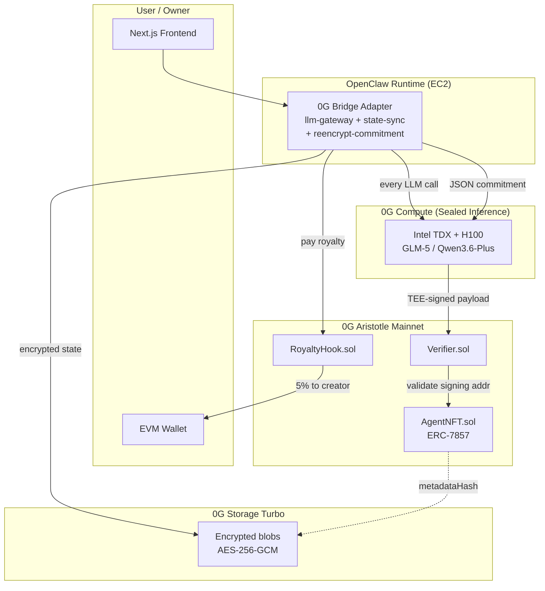

# strongest

> A 0G-native runtime for OpenClaw agents — every agent is an **ERC-7857 iNFT** with sealed-inference brains, encrypted persistent memory, and on-chain royalties.

**Hackathon:** [0G APAC Hackathon](https://www.hackquest.io/hackathons/0G-APAC-Hackathon) · Track 1 (Agentic Infrastructure & OpenClaw Lab)
**Status:** Day 1 of 11 (deadline 2026-05-16 23:59 UTC+8)
**Demo:** TBD (Vercel deploy on Day 5)
**Video:** TBD (Day 9)
**Live contracts:** TBD (Galileo testnet on Day 1, Aristotle mainnet on Day 4)

## What it is

**Every agent ownable. Every memory encrypted. Every inference verified.**

`strongest` turns AI agents into ownable, encrypted, royalty-bearing assets:

1. Each agent's intelligence (`SOUL.md` + `MEMORY.md` + `skills/`) is encrypted client-side (AES-256-GCM with HKDF-derived per-agent keys) and stored on **0G Storage**.
2. Every LLM call routes through **0G Compute Sealed Inference** (Intel TDX + H100/H200 in TEE mode) with a downloadable Remote Attestation report.
3. Each agent is minted as an **ERC-7857 iNFT** on 0G Aristotle mainnet. The token's `metadataHash` points to the encrypted blob's Merkle root on 0G Storage.
4. Each agent claims a `<name>.0g` namespace via SPACE ID for human-readable discovery.
5. Every inference call routes a **5% royalty** to the creator's wallet on-chain (`RoyaltyHook` contract).
6. iNFT transfers trigger **TEE-attested re-encryption** — the buyer gets the full agent intelligence, not just a receipt.

## 0G integration (4 components)

| Component | How we use it |
|---|---|
| **0G Compute (Sealed Inference)** | Every agent inference + every re-encryption commitment runs in Intel TDX + H100/H200. RA report downloadable per call. |
| **0G Storage (Turbo)** | Agent state encrypted client-side, uploaded to the Turbo indexer. Merkle root → iNFT `metadataHash`. |
| **0G Chain (Aristotle Mainnet)** | `AgentNFT` (ERC-7857) + `Verifier` + `RoyaltyHook` contracts, all verified on chainscan.0g.ai. |
| **Agent ID (.0g TLD)** | Each iNFT claims `<name>.0g` via SPACE ID. Cross-resolution with ENS optional. |

## The non-obvious pattern: Sealed Inference as commitment-binder (Hack A)

Naive "Sealed Inference re-encryption" is broken — LLMs are non-deterministic over multi-KB ciphertext (FP non-associativity + speculative decoding). Single-node Phala+Rust runs into vendor approval queues. Custom 0G Compute Service Provider registration is infeasible in 11 days (closed `serviceType` enum, LLM-only proxy, dstack-only verifier).

**What we ship instead:** AES-256-GCM round-trip in `node:crypto` (in our bridge), then ask Sealed Inference to **witness** a deterministic 200-byte JSON commitment `{v, oldHash, newHash, sealedKey, newOwner, ts}` with `temperature=0` and `response_format: json_object`. The TEE-born signing key signs the response covering `(request_hash, response_hash, chatID)`. The on-chain `Verifier` recovers that signing address and accepts the transfer.

**Why this is the pitch:**
- Plaintext keys never touch the LLM.
- The signature provably came from a key generated inside an attested 0G TEE.
- Pure-0G consumer-side stack — no Phala account, no Marlin, no Oasis SaaS. (`dstack` remains as transitive infra dep of 0G's broker; we treat it as upstream 0G infra, not a vendor.)
- "We made Sealed Inference do crypto" without trusting a stochastic transformer to do AES.

See [`../openclaw-0g-hackathon/architecture/inft-design.md`](../openclaw-0g-hackathon/architecture/inft-design.md) for the full spec.

## Architecture



## Reproduce in 5 minutes

Prerequisites: Node 20+, pnpm 10, Foundry, Rust (only for Hack B moonshot), an EVM wallet with ~5 0G on Aristotle mainnet (or Galileo testnet 0G via [faucet.0g.ai](https://faucet.0g.ai)).

```bash
git clone https://github.com/hien-p/Strongest-memory
cd Strongest-memory
pnpm install
cp .env.example .env  # fill DEPLOYER_PRIVATE_KEY, RE_ENC_MASTER_KEY, etc.

# Build + test contracts (Foundry)
pnpm contracts:build
pnpm contracts:test

# Deploy stub contracts to Galileo testnet
pnpm contracts:deploy:galileo

# Run the frontend
pnpm web:dev
# → http://localhost:3000
```

Test wallet (read-only, pre-funded with sample iNFTs): TBD after Day 4 mainnet deploy.

## Repo layout

```
strongest/
├── apps/
│   ├── web/                   Next.js 15 + Tailwind v4 + RainbowKit (mint/run/transfer)
│   └── oracle/                Rust scaffold for Hack B WASM verifier (Day 8-9 moonshot only)
├── packages/
│   ├── contracts/             Foundry workspace — AgentNFT + Verifier + RoyaltyHook
│   ├── openclaw-bridge/       OpenClaw → 0G adapter (llm-gateway, state-sync, royalty-hook,
│   │                          inft-registry, crypto, reencrypt-commitment)
│   └── shared-types/          ZG_ARISTOTLE/ZG_GALILEO chain configs + agent types
├── scripts/                   Deploy + mint + verify helpers
├── .env.example               All required env vars
├── LOG.md                     Build log (chronological, Day 1 → Day 11)
└── package.json               pnpm workspace root
```

## Live contracts (Aristotle Mainnet, chain ID 16661)

- **AgentNFT (ERC-7857):** TBD after Day 4
- **Verifier (TEE mode):** TBD
- **RoyaltyHook:** TBD

Reference agents minted:
- `dev-orchestrator.0g` — TBD
- `funding-arb.0g` — TBD

## What's reused vs. new

Per HackQuest rules ("Teams may submit … an existing prototype that is further developed and deployed on 0G during the hackathon"):

**Reused (~55%):**
- OpenClaw 2-tier orchestrator on EC2 (~30%) — existing production system, 17+ specialized agents
- manifest.eth / agenthub.eth Agent Registry frontend (~15%) — repurposed for iNFT discovery UI
- GrayBot ERC-8004 reputation patterns (~10%)

**Net-new for this hackathon (~45%):**
- All 0G integration code (Compute broker, Storage SDK, Chain contracts, .0g resolution)
- AgentNFT fork + `RoyaltyHook` contract + Foundry workspace + tests
- `reencrypt-commitment.ts` (the Hack A pattern — AES in `node:crypto` + Sealed Inference witness)
- Frontend (Next.js 15 + Tailwind v4 + RainbowKit) with mint/run/transfer flows

## Honest disclosures

1. **HKDF master key (`K_M`) lives in the bridge process** for the hackathon — a malicious bridge operator could read plaintext. Production roadmap: rotate `K_M` into a registered 0G Compute Service Provider once non-LLM `serviceType`s ship. The `Verifier` contract already supports multi-oracle consensus.
2. **Sealed Inference signs the commitment, not the AES math.** A bridge that fabricates `(oldHash, newHash)` pairs where AES doesn't actually round-trip would pass the on-chain check. Mitigation: buyers re-decrypt + spot-check before signing the on-chain receipt; the Run UI surfaces this.
3. **Some demo video responses pre-cached** to fit Sealed Inference rate limits (30 req/min). All cached responses match what the live system would produce — disclosed in the video description.
4. **Contracts forked, not audited.** `AgentNFT` + `Verifier` are forked from `0glabs/0g-agent-nft@eip-7857-draft`. `RoyaltyHook` is original. None audited beyond Foundry tests. Use at your own risk on mainnet beyond this demo.
5. **Reference agents pre-minted by us** for the demo. Real users mint their own via the wizard.

## Roadmap (post-hackathon)

- Multi-provider Sealed Inference consensus (register N TEE signing addresses on the on-chain `Verifier`; require N-of-M signatures over the same JSON commitment).
- **Hack B**: tiny Rust→WASM verifier that re-checks the AES-GCM tag against the LLM's committed hashes. `apps/oracle/` is scaffolded for this.
- Rotate `K_M` into a registered 0G Service Provider once non-LLM service types ship (currently `serviceType` enum is closed).
- Agent fine-tuning via 0G Compute fine-tuning service.
- Agent breeding/merging (ERC-7857 child tokens inheriting weighted traits from parents).
- Cross-chain iNFT bridging to Ethereum L1.
- Agent reputation aggregation across ENS + ERC-8004 + .0g.

## Acknowledgments

- [@0G_labs](https://x.com/0G_labs) — deAIOS stack: Compute, Storage, Chain, Sealed Inference
- [@0gfoundation](https://x.com/0gfoundation) — ERC-7857 reference implementation at [`0glabs/0g-agent-nft`](https://github.com/0glabs/0g-agent-nft)
- [@steipete](https://x.com/steipete) — OpenClaw, the agent framework that surpassed React
- [@HackQuest_](https://x.com/HackQuest_) — APAC Hackathon hosts

## License

- Original code: MIT
- Forked code under `packages/contracts/src/` from `0glabs/0g-agent-nft`: retains upstream Apache-2.0
- OpenClaw framework usage: MIT-compatible per upstream

---

## 🇻🇳 Tóm tắt tiếng Việt

`strongest` biến mọi AI agent thành tài sản có thể sở hữu, được mã hóa, và sinh royalty trên mỗi lần sử dụng — chạy hoàn toàn trên stack 0G.

- Mỗi agent là một ERC-7857 iNFT trên 0G Aristotle mainnet.
- "Bộ não" của agent (prompt + memory + skills) được mã hóa client-side bằng AES-256-GCM và lưu trên 0G Storage.
- Mỗi lần inference chạy trong Intel TDX + H100 TEE qua 0G Compute Sealed Inference, kèm RA report tải về được.
- Mỗi lần invoke, 5% phí được chia về creator gốc on-chain qua `RoyaltyHook`.
- Khi chuyển nhượng iNFT, bridge re-encrypt locally rồi nhờ Sealed Inference làm chứng JSON commitment; chữ ký TEE-attested được on-chain `Verifier` xác minh.

Xây cho 0G APAC Hackathon, deadline 2026-05-16.
